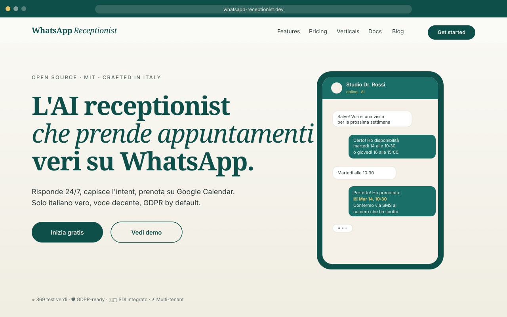
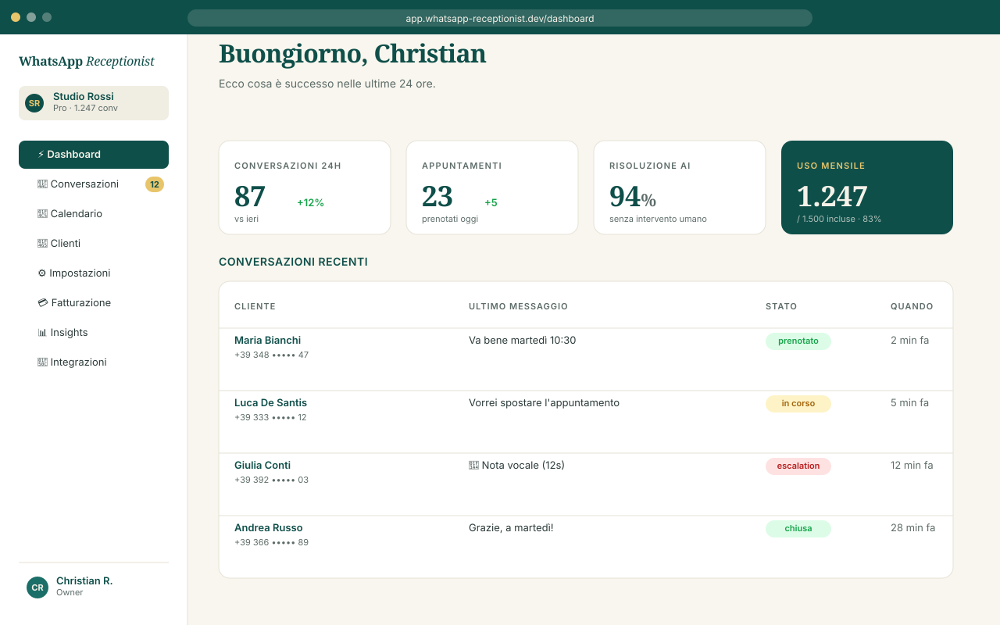
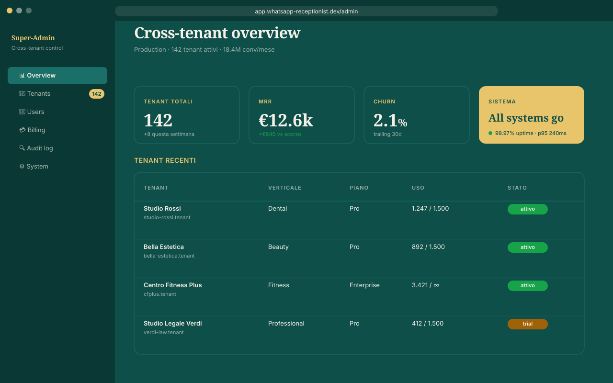
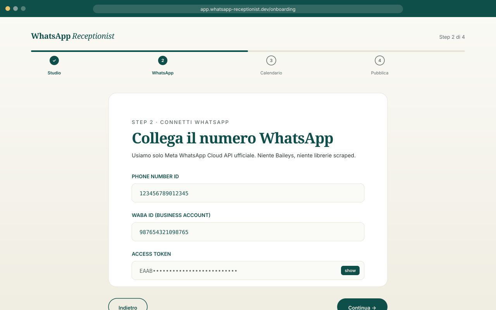

<div align="center">
  

# WhatsApp Receptionist

### The open-source AI receptionist that books real appointments on WhatsApp

**Crafted in Italy 🇮🇹 · GDPR-ready · Self-hostable in 30 minutes**

[](LICENSE)
[](https://nextjs.org/)
[](https://react.dev/)
[](https://www.typescriptlang.org/)
[](https://anthropic.com)
[](#tests)
[](#gdpr--security)
[](https://github.com/Hiberius/whatsapp-receptionist/stargazers)

[Live Demo](#live-demo) · [Documentation](docs/) · [Quickstart](#quickstart) · [Roadmap](#roadmap) · [Italiano 🇮🇹](README.it.md)

</div>

---

## What it does



In 3 sentences:

- **Receives WhatsApp messages and voice notes** from your customers, 24/7
- **Understands intent, books real appointments** on Google Calendar, sends confirmations
- **Hands off to a human (you)** only when needed — escalation rules you control

### Honest state of play

We publish the gap rather than let you discover it after cloning. Most of the product path now
works end to end; what does not is named here explicitly.

| Layer | State |
|---|---|
| Domain services (`src/server/`) | **Real.** Booking with availability + anti-double-booking, Stripe subscription lifecycle, WhatsApp outbox with `FOR UPDATE SKIP LOCKED`, retry/backoff and dead-letter, webhook idempotency, Google Calendar OAuth, pgvector RAG, GDPR Art. 15/17. Covered by 395 tests. |
| Database (`supabase/migrations/`) | **Real.** 22 tables, RLS policies, `timestamptz` throughout, money as integer cents, exclusion constraint against double-booking. |
| Security primitives | **Real.** Stripe signature over raw body, timing-safe secret comparison, HMAC-signed OAuth state bound to tenant, AES-256-GCM for stored tokens, nonce-based CSP. |
| Tenant dashboard | **Wired.** Dashboard, conversations inbox with operator reply, calendar, billing, WhatsApp settings and knowledge base all read live tenant data. |
| Self-service signup | **Working.** Register → magic link → `/auth/callback` → onboarding → dashboard, with auth guards on every authenticated segment. |
| WhatsApp provisioning | **Working.** A tenant can attach its own number from the UI; the API key is encrypted at rest and a number cannot be claimed by a second tenant. |
| Background jobs | **Working.** The five Vercel cron jobs previously returned 405 on every run — the outbox was never drained. Fixed, with a test tying `vercel.json` to the route handlers. |
| Cross-tenant admin panel | **Not wired.** Tenants, users, billing and audit views state plainly that they are not connected and point at the authoritative source. Wiring them needs a dedicated `src/server/admin/` service with isolation tests, because those reads bypass RLS. |

38 frontend pages, 38 API routes, TypeScript strict with `exactOptionalPropertyTypes`, 395 tests
passing, production build verified, **zero vulnerabilities in production dependencies**.

See [docs/audit/2026-07-27-audit-prodotto.md](docs/audit/2026-07-27-audit-prodotto.md) for the full
self-audit this table is drawn from.

---

## Features

|     |     |
| --- | --- |
| **WhatsApp + voice** | Text messages and voice notes via the 360dialog Business API (an official Meta BSP) + ElevenLabs STT/TTS. No Baileys, no scraped clients. |
| **Real bookings** | Google Calendar OAuth, conflict detection, automatic confirmations, reminders, reschedule flows. |
| **Anthropic Claude** | Intent extraction, conversation orchestration, prompt caching, fallbacks, escalation rules. |
| **GDPR-native** | Art. 15 export + Art. 17 delete endpoints, audit logging, EU hosting (Supabase Frankfurt + Upstash EU). |
| **Stripe + Italian SDI** | Stripe Subscriptions and Customer Portal, plus electronic invoicing for Italian B2B via Fatture in Cloud. |
| **Multi-tenant** | Supabase Row Level Security on every table. Ready for SaaS, agency white-label, or single-tenant self-host. |
| **Editorial design** | Custom design system, OKLCH palette, Fraunces + Inter, fluid typography, full a11y (95+ Lighthouse). |
| **Production hardened** | CSP nonce per request, HSTS, COEP/COOP/CORP, timing-safe webhook verification, Pino with PII redact. |

---

## Tech stack

[](https://nextjs.org/)
[](https://react.dev/)
[](https://www.typescriptlang.org/)
[](https://supabase.com/)
[](https://orm.drizzle.team/)
[](https://anthropic.com)
[](https://elevenlabs.io)
[](https://stripe.com)
[](https://upstash.com)
[](https://vitest.dev/)

| Layer | Choice | Why |
| --- | --- | --- |
| Framework | **Next.js 15.5** App Router | Server Components, Route Handlers, edge-ready middleware |
| Runtime | **React 19** + Node 22 | Latest stable, async server components, concurrent rendering |
| Language | **TypeScript 5.9 strict** | `exactOptionalPropertyTypes`, `noUncheckedIndexedAccess`, zero `any` in src |
| Database | **Supabase Postgres EU** + **Drizzle ORM** | Managed Postgres in Frankfurt, type-safe migrations, RLS native |
| Auth | **Supabase Auth** | httpOnly + secure + sameSite=lax cookies, SSR-aware session |
| AI orchestration | **Anthropic Claude Opus 4.7 Max** | Best-in-class tool use, prompt caching, predictable latency |
| Voice | **ElevenLabs STT + TTS** | Italian voice quality matters — ElevenLabs nails it |
| Messaging | **360dialog Business API** | Official Meta BSP (`waba-v2.360dialog.io`). No Baileys, no scraped clients. |
| Calendar | **Google Calendar OAuth** | Encrypted token storage, conflict detection, multi-calendar |
| Billing | **Stripe Subscriptions + Customer Portal** | + **Fatture in Cloud** for Italian SDI invoicing |
| Rate limit | **Upstash Redis EU** | Edge-friendly, distributed, named policies per endpoint |
| Logging | **Pino** | Structured JSON, automatic PII redact (email, phone, IBAN, fiscal_code, …) |
| Testing | **Vitest 4** | 395 tests, unit + integration + smoke, v8 coverage |
| Tooling | **ESLint 9 flat** + **Prettier 3** + **Husky** + **lint-staged** | Pre-commit gitleaks, lint-staged, format on save |

---

## Quickstart

```bash
git clone https://github.com/Hiberius/whatsapp-receptionist.git
cd whatsapp-receptionist
cp .env.example .env.local
# fill in your env vars (see docs below)
npm install
npm run dev
```

Open <http://localhost:3000> — done.

For the full env reference, see [`.env.example`](.env.example) (~30 variables documented inline).

For production deployment, see [`docs/deployment.md`](docs/deployment.md).

---

## What's included

- **35 frontend pages** — landing, pricing, 4 verticals (dental, beauty, fitness, professional), blog, help center, dashboard (5 sections), admin panel (6 sections), 5 legal pages
- **37 API routes** — auth, billing, conversations, calendar, GDPR (Art. 15/17), webhooks (Stripe + WhatsApp), health deep, internal jobs, contact
- **7 Supabase migrations** — 21 tables, full RLS, GDPR audit log, contact submissions
- **395 tests passing** — unit + integration + smoke, Vitest 4 with v8 coverage
- **Full design system** — OKLCH editorial palette, Fraunces (display) + Inter (body), fluid clamp() typography, design tokens in CSS custom properties
- **JSON-LD schemas** — Organization, SoftwareApplication, FAQ, Breadcrumb (programmatically injected)
- **Security middleware** — CSP nonce-based per request, HSTS preload, COEP, COOP, CORP, X-Frame-Options DENY
- **Italian SDI integration** — electronic invoicing via Fatture in Cloud (B2B compliance)
- **CI workflow** — typecheck + lint + tests + production build + secret scan (gitleaks)

---

## Architecture

```
src/
├── app/
│   ├── (admin)/              ← super-admin cross-tenant panel (6 pages)
│   ├── (auth)/               ← login, register
│   ├── (dashboard)/          ← tenant dashboard (5 sections)
│   ├── api/                  ← 37 route handlers
│   ├── legal/                ← privacy, terms, DPA, cookie, security
│   ├── verticali/            ← marketing pages per vertical
│   ├── blog/, help/, docs/   ← content surfaces
│   ├── pricing/              ← plans
│   ├── onboarding/           ← 4-step wizard
│   ├── opengraph-image.tsx   ← dynamic OG image generation
│   └── page.tsx              ← landing
├── components/
│   ├── marketing/            ← Hero, Features, Verticals, Pricing, CTA, …
│   └── dashboard/            ← DashboardShell with sidebar
├── lib/
│   ├── api/                  ← jsonHandler, body parsing, errors
│   ├── auth/                 ← session, cookies, super-admin gate
│   ├── logging/              ← Pino with redact PII
│   ├── rate-limit/           ← Upstash policies + apply helper
│   ├── security/             ← CSP nonce, timing-safe static-secret
│   ├── stripe/               ← webhook signature verification
│   ├── supabase/             ← server + admin client (SSR-aware)
│   └── whatsapp/             ← webhook signature verification
├── server/
│   ├── ai/                   ← Anthropic adapter, intent router, booking extractor
│   ├── appointments/         ← booking, notifications, conflict detection
│   ├── billing/              ← Stripe + Fatture in Cloud SDI
│   ├── calendar/             ← Google Calendar provider
│   ├── conversations/        ← inbox, operator messages
│   ├── gdpr/                 ← data-export Art.15 + data-delete Art.17
│   ├── integrations/         ← OAuth state encryption
│   ├── knowledge-base/
│   ├── onboarding/           ← tenant onboarding flow
│   ├── settings/             ← tenant settings
│   ├── usage/                ← usage limits + auto-reply guard
│   └── whatsapp/             ← service, repository, outbox, voice-pipeline
├── styles/                   ← tokens.css + globals.css (design system)
└── middleware.ts             ← CSP nonce + COEP + COOP + CORP

supabase/migrations/          ← 7 migrations, full RLS, GDPR audit log
tests/                        ← unit + integration + smoke (395 tests)
docs/                         ← architecture, API contract, deployment, schema
```

For diagrams, see [`docs/architecture/`](docs/architecture/).

---

## GDPR & security

This is built for the European market. The defaults reflect that.

- **CSP nonce-based** per request ([`src/middleware.ts`](src/middleware.ts))
- **HSTS preload, COEP, COOP, CORP, X-Frame-Options DENY** (middleware + `next.config.ts`)
- **Webhook signature verification** with timing-safe comparison (Stripe + WhatsApp)
- **PII redact in logs** automatic for email, phone, fiscal_code, vat_number, IBAN, OAuth tokens
- **Rate limit Upstash** with named policies (auth, onboarding, settings, GDPR export, contact)
- **Cookies** httpOnly + secure (prod) + sameSite=lax via `getSecureCookieOptions()`
- **GDPR Art. 15 (export)** and **Art. 17 (delete)** endpoints with audit_log
- **Row Level Security** on all 21 tables, validated by `npm run db:lint`
- **Pre-commit gitleaks** scan via Husky + lint-staged

A customer-facing security page lives at `/legal/security`.

---

## Quality gate

Merging to `main` requires `npm run verify` green:

```bash
npm run verify
# = typecheck + lint + test + db:lint
```

- **TypeScript strict** with `exactOptionalPropertyTypes` — clean
- **ESLint 9** flat config — < 60 warnings, 0 errors
- **395 tests** passing
- **21 tables** with RLS abilitato, validated programmatically

CI pipeline (GitHub Actions): `verify` → `coverage` → `production build` → `secret scan`.

---

## Live demo

A hosted demo is on the roadmap. For now, clone the repo and run `npm run dev` — you'll have a fully working tenant in under 5 minutes (mock WhatsApp webhook included).

Demo screenshots:

| | |
| --- | --- |
| Landing |  |
| Pricing |  |
| Vertical (Dental) |  |
| Dashboard |  |
| Admin panel |  |
| Onboarding |  |

> Real screenshots will replace these placeholders once a public demo is live. Contributions welcome — see `docs/screenshots/README.md` for capture instructions.

---

## Why this exists

There are AI chatbots and there are booking systems. Nothing combines them with European GDPR rigor and Italian B2B fiscal compliance (SDI / Fatture in Cloud). I built this because I wanted to deploy a real AI receptionist for a clinic in Italy and couldn't find anything self-hostable that ticked all the boxes.

The codebase is the result of three weeks of compressed engineering with [Claude Code](https://claude.ai/code) as a pair programmer, plus a couple of decades of deploying SaaS for European SMBs.

If you find it useful, please star the repo. If you fork it commercially, that's totally fine — MIT means MIT — just don't claim you wrote it from scratch.

---

## Roadmap

Short-term (next 60 days):

- [ ] Hosted live demo with sandbox WhatsApp number
- [ ] Telegram + Instagram DM channels (same orchestrator, different transport)
- [ ] Native voice calls (ElevenLabs Conversational + Twilio)
- [ ] Outlook Calendar provider (alternative to Google)
- [ ] German + French i18n (Italian + English already shipping)

Medium-term:

- [ ] Webhooks for tenant integrations (Make, n8n, Zapier)
- [ ] Native mobile dashboard (React Native or Expo)
- [ ] CRM sync (HubSpot, Pipedrive, Notion)
- [ ] Vertical-specific agents marketplace

Long-term:

- [ ] Self-hosted edition with full local LLM fallback (Ollama)
- [ ] Marketplace for community-built integrations

---

## Contributing

PRs welcome. See [`CONTRIBUTING.md`](CONTRIBUTING.md) for the workflow.

This codebase is primed for [Claude Code](https://claude.ai/code) — there's an `AGENTS.md` in the root that primes the model for this project's conventions. If you use Claude Code, just open the repo and start working.

For non-Claude contributors: the codebase follows tight TypeScript strict, ESLint 9 flat config, Prettier 3, and Husky pre-commit hooks. Run `npm run verify` before pushing.

---

## Acknowledgments

- [Anthropic](https://anthropic.com) for Claude Opus 4.7 Max — half of this code was written in pair with Claude Code
- [Supabase](https://supabase.com) for making multi-tenant Postgres + RLS trivial
- [Vercel](https://vercel.com) for Next.js
- [ElevenLabs](https://elevenlabs.io) for Italian voice that doesn't sound robotic
- The Italian SaaS community

---

## License

MIT © [Christian Calabrò](https://github.com/Hiberius)

See [`LICENSE`](LICENSE) for the full text.

---

<div align="center">

Made with care in Italy by Christian Calabrò ([@hiberius](https://github.com/Hiberius))

If this saved you time, [star the repo](https://github.com/Hiberius/whatsapp-receptionist) — it's the one currency that funds open source.

</div>
