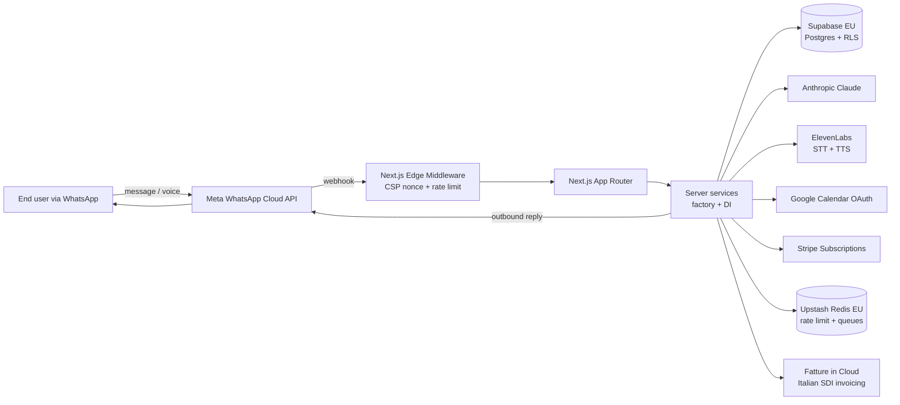

# Architecture

A high-level map of how WhatsApp Receptionist is organised, why those choices were made, and where the boundaries are.

## System overview



## Layered architecture

The repo follows a strict three-layer split inside `src/`:

```
src/
├── app/             ← routing layer (Next.js App Router)
│   ├── api/         ← route handlers (thin: parse, validate, delegate)
│   ├── (admin)/     ← super-admin pages
│   ├── (auth)/      ← login, register
│   ├── (dashboard)/ ← tenant pages
│   └── ...          ← marketing, legal, blog, help
├── lib/             ← infrastructure (cross-cutting)
│   ├── api/         ← jsonHandler, request body parsers
│   ├── auth/        ← session helpers, cookie options
│   ├── db/          ← Drizzle client
│   ├── errors/      ← AppError class + error mapping
│   ├── logging/     ← Pino with PII redact
│   ├── rate-limit/  ← Upstash policies + apply helper
│   ├── security/    ← CSP nonce, timing-safe comparison
│   ├── stripe/      ← webhook verification
│   ├── supabase/    ← server + admin clients
│   └── whatsapp/    ← signature verification
├── server/          ← domain services (business logic)
│   ├── ai/          ← Anthropic adapter, intent router, booking extractor
│   ├── appointments/← booking, notifications, conflict detection
│   ├── billing/     ← Stripe + Italian SDI invoicing
│   ├── calendar/    ← Google Calendar provider
│   ├── conversations/← inbox, operator messages
│   ├── gdpr/        ← Art. 15 export, Art. 17 delete
│   ├── integrations/← OAuth state encryption
│   ├── knowledge-base/← retrieval
│   ├── onboarding/  ← tenant creation flow
│   ├── settings/    ← tenant config
│   ├── usage/       ← limits, auto-reply guard
│   └── whatsapp/    ← outbox, voice, repository, webhook events
└── components/      ← React server components
```

### Why three layers

- **Routing** is thin. Route handlers parse with Zod, call a server service, return a typed response. Nothing else.
- **Infrastructure** (`lib/`) wraps external systems and shared concerns. Stable, dependency-free, testable in isolation.
- **Domain** (`server/`) holds business logic. Every service is a factory that takes its dependencies as parameters, so tests can inject fakes without mocks.

If you find domain logic in `app/api/` or infrastructure code in `server/`, that's a smell.

## Multi-tenancy

Every table has a `tenant_id` column with a Postgres Row-Level Security policy that requires it to match the authenticated user's tenant. RLS is the security boundary: even if application code forgets to filter by tenant, the database returns nothing.

The `npm run db:lint` script verifies that every table has RLS enabled and at least one policy. CI fails if a migration adds a table without RLS.

## Authentication flow

1. User submits email on `/login`
2. `POST /api/auth/magic-link` calls Supabase `signInWithOtp`
3. Supabase emails a one-time link
4. User clicks link → Supabase callback sets httpOnly + secure + sameSite=lax cookie
5. Subsequent server requests read the cookie via `requireSession()` or `requireAuthenticatedUser()`
6. Tenant ID + role are pulled from JWT app_metadata, validated, and threaded through all server calls

No client-side session state. No localStorage tokens.

## AI orchestration

Inbound message → classifier (rule-based + LLM-assisted) → intent (booking / info / urgency / spam / out-of-scope) → handler:

- **Booking intent** → extractor pulls service, date, time, urgency → calendar provider checks availability → 3 slots proposed → user confirms → event created
- **Info intent** → knowledge-base retrieval → templated response
- **Urgency** → escalation to human, push notification to tenant owner
- **Spam / out-of-scope** → polite decline

Anthropic Claude Sonnet is the primary model. Prompt caching is enabled for the system prompt. There's a fallback path to OpenAI configured but disabled by default.

## Voice pipeline

WhatsApp inbound voice → audio downloaded to Supabase Storage → ElevenLabs Speech-to-Text (Italian model preferred) → text fed into the same intent classifier → response generated → optional Text-to-Speech back via ElevenLabs → outbound voice message via WhatsApp Cloud API.

Voice events are tracked in `voice_events` table with retention 90 days.

## Webhook security

Both Stripe and WhatsApp webhooks verify signatures with constant-time comparison. The verification secret is loaded from env at startup. Idempotency is guaranteed via the `webhook_events` table: every webhook ID is recorded, and replays are no-ops.

## Rate limiting

Upstash Redis with named policies in `src/lib/rate-limit/policies.ts`:

- `authLogin`: 5 / 15min
- `authMagicLink`: 3 / hour
- `onboarding`: 10 / hour
- `settingsWrite`: 30 / minute
- `gdprExport`: 1 / day
- `gdprDelete`: 1 / day
- `contactForm`: 5 / minute
- Webhook bursts: 100-120 / minute per IP

Each rate-limited endpoint sets a `Retry-After` header on 429.

## GDPR endpoints

- **Article 15 (export)**: `GET /api/tenant/export` and `POST /api/customers/[phone]/export` — produce JSON exports of all data the tenant or end-customer owns
- **Article 17 (delete)**: `DELETE /api/tenant/account` (with 30-day grace period) and `DELETE /api/customers/[phone]` (immediate). Hard delete cron at 3 AM cleans up tenants past their grace period
- All actions logged immutably in `audit_log` with `action`, `actor_id`, `subject_id`, `at`, `metadata`

## Observability

- **Logging**: Pino structured JSON, automatic PII redaction (email, phone, IBAN, fiscal_code, vat_number, customer_name, address)
- **Health checks**: `/api/health` (edge, fast) and `/api/health/deep` (node, checks Supabase + Upstash + Stripe connectivity)
- **Sentry**: optional, enabled by setting `SENTRY_DSN` env var
- **CI**: every push runs typecheck + lint + 369 tests + production build + gitleaks secret scan

## Testing strategy

- **Unit**: pure functions, factory services with fake dependencies
- **Integration**: API route handlers with in-memory database fakes
- **Smoke**: every route exports correct HTTP method handlers (auto-discovery test)
- **Coverage threshold**: 60% lines / 50% branches (configured in `vitest.config.ts`)

## Frontend architecture

- 100% Server Components by default. Client components only where interactivity is unavoidable.
- Custom CSS design system in `src/styles/{tokens.css,globals.css}` — no Tailwind, no UI library
- Fluid typography with `clamp()`, OKLCH palette, motion respects `prefers-reduced-motion`
- JSON-LD schemas injected programmatically (Organization, SoftwareApplication, FAQ, Breadcrumb, Article, Service, HowTo)

## What this is NOT

- It's not a generic chatbot framework — it's specifically tuned for receptionist-style booking flows
- It's not multi-language at runtime — Italian and English copy is hand-curated, not auto-translated
- It's not a full PMS / CRM — it integrates with calendars, but doesn't replace dedicated practice management software
- It's not zero-config — Meta WhatsApp Business approval is the bottleneck (1-3 weeks)

## Further reading

- [DATABASE.md](DATABASE.md) — schema details and RLS patterns
- [DEPLOYMENT.md](DEPLOYMENT.md) — production deployment guide
- [api-contract.md](api-contract.md) — full API reference
- [FAQ.md](FAQ.md) — common questions
- [ROADMAP.md](ROADMAP.md) — what's next
